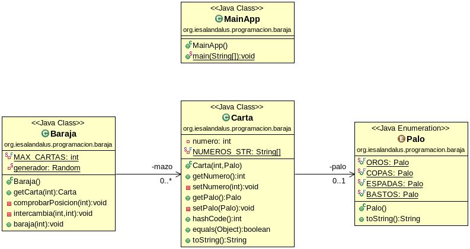

# Baraja
## José Ramón Jimenez Reyes

Debes crear un programa que modele una baraja de cartas y simule que intercambias cartas de posiciones aleatorias n veces y muestre cuántas se han quedado en la misma posición inicial y el resultado final de la baraja. Para ello te propongo el siguiente diagrama de clases:

Las tareas que debes realizar son las siguientes:

    - Crea un enumerado llamado Palo con cada uno de los palos de una baraja de carta: OROS, COPAS, ESPADAS, BASTOS.
    - Crea una clase Carta:
        - Añade como atributos numero (un entero entre 1 y 10) y palo.
        - Implementa los métodos de acceso a los parámetros (set y get), teniendo en cuenta que ni el número ni el palo podrán ser cambiados una vez creada la carta. Además, en el caso del set deberás asegurar que los valores sean válidos. En caso de no ser así, deberá lanzar la excepción IllegalArgumentException con el mensaje adecuado.
        - Implementa el constructor con los parámetros adecuados y que haga el mismo control que en el caso anterior
        - Implementa el método equals, considerando que dos cartas son iguales si tienen el mismo número y son del mismo palo.
        - Implementa el método toString que serialice una carta de la forma: As de oros, Dos de copas,..., Sota de espadas,Caballo de oros, Rey de bastos.
    - Crea una clase Baraja:
        - Añade como atributo un array de Cartas que tendrá como máximo MAX_CARTAS y cuyo valor será 40.
        - Implementa un constructor por defecto que inicialice el array poniendo en primer lugar las 10 cartas de oros, luego las 10 cartas de copas, luego las 10 cartas de espadas y finalmente las 10 cartas de bastos.
        - Implementa un método llamado getCarta que dada una posición devuelva la carta que ocupa dicha posición en la baraja. Debes validar que la posición indicada sea correcta, debiendo lanzar la excepción IllegalArgumentException con el mensaje adecuado.
        - Implementa un método llamado intercambia que acepte la posición de dos cartas (debes validar que son correctas las posiciones) y las intercambia en el array de cartas, es decir, en la posición primera pone la carta que ocupaba la posición segunda y viceversa. En el caso de que las posiciones a intercambiar no sean válidas deberá lanzar la excepción IllegalArgumentException con el mensaje adecuado.
        - Implementa un método llamado barajar que acepte como parámetro un entero indicando las veces que queremos intercambiar dos cartas. Para ello generarás dos números aleatorios entre 0 y MAX_CARTAS e intercambiarás las cartas de dichas posiciones y ésto lo repetirás las veces que indique el parámetro.
    - Crea una clase Principal que haciendo uso de la clase Entrada que te proporciono en los recursos necesarios, pida el número de veces a intercambiar dos cartas (llamada al método barajar) y una vez terminado compruebe cuántas cartas no se han movido de su posición y nos informe de ello. Para ello crea una instancia de Baraja que será sobre la que invoques el método barajar y otra que simplemente la crearás (por lo que mantendrá sus cartas ordenadas). Luego recorre una de las barajas, comparando la carta de cada posición de una y otra baraja para determinar el número de cambios que han ocurrido.
